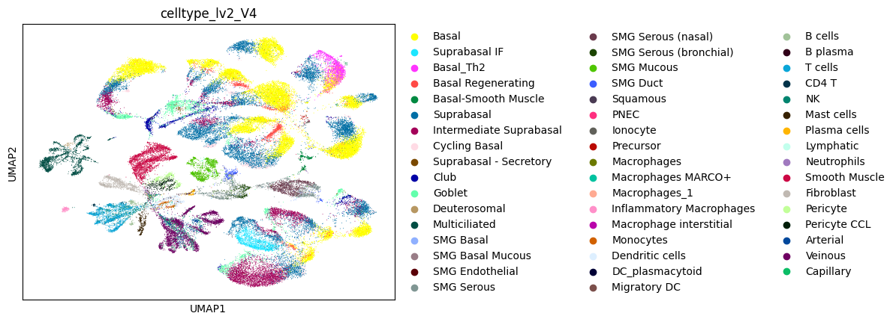

# longreadtools


<!-- WARNING: THIS FILE WAS AUTOGENERATED! DO NOT EDIT! -->

## Install

``` sh
pip install git+https://github.com/cobioda/longreadtools.git
```

## How to use

Here we will use the `isomatrix_tools` module to convert our isomatrix
txt files in bulk into `anndata` objects using the
[`multiple_isomatrix_conversion`](https://cobioda.github.io/longreadtools/isomatrix_tools.html#multiple_isomatrix_conversion)
function . Then, we will utilize our specialized
[`concatenate_anndata`](https://cobioda.github.io/longreadtools/isomatrix_tools.html#concatenate_anndata)
function to generate a concatenated `anndata` for downstream analysis.

``` python
from longreadtools.isomatrix_tools import *
```

``` python
# # Importing required libraries
# import os
# import re

# # Defining the directory path
# directory = '/data/analysis/data_mcandrew/000-sclr-discovair/'

# # Defining the regular expression pattern to match the required files
# pattern = re.compile('.*(_BIOP_INT|BIOP_NAS)$')

# # Getting a list of all files in the directory
# all_files = os.listdir(directory)

# # Filtering the list to include only files that match the pattern
# matching_files = [os.path.join(directory, f) for f in all_files if pattern.match(f)]

# # Printing the list of matching files
# print(matching_files)

# # Assigning the list of matching files to the variable 'individual_runs'
# individual_runs = matching_files

# # Adding '_isomatrix.txt' to each file name in the 'individual_runs' list
# individual_runs = [f'{run}_isomatrix.txt' for run in individual_runs]

# # Creating a list of paths for each isomatrix file in the 'matching_files' list
# isomatrix_paths = [os.path.join(run, f'{os.path.basename(run)}_isomatrix.txt') for run in matching_files]
```

``` python
# converted_isomatrix_paths = multiple_isomatrix_conversion(isomatrix_paths, verbose=True, return_paths = True)
```

``` python
import scanpy as sc 
data = sc.read_h5ad("/data/analysis/data_mcandrew/000-sclr-discovair/D534_BIOP_INT/D534_BIOP_INT_isomatrix.h5ad")
```

``` python
# isomatrix_list = ('/data/analysis/data_mcandrew/000-sclr-discovair/D498_BIOP_INT/D498_BIOP_INT_isomatrix.h5ad',
#  '/data/analysis/data_mcandrew/000-sclr-discovair/D492_BIOP_NAS/D492_BIOP_NAS_isomatrix.h5ad')
```

``` python
isomatrix_list = ('/data/analysis/data_mcandrew/000-sclr-discovair/D498_BIOP_INT/D498_BIOP_INT_isomatrix.h5ad',
 '/data/analysis/data_mcandrew/000-sclr-discovair/D492_BIOP_NAS/D492_BIOP_NAS_isomatrix.h5ad',
 '/data/analysis/data_mcandrew/000-sclr-discovair/D494_BIOP_INT/D494_BIOP_INT_isomatrix.h5ad',
 '/data/analysis/data_mcandrew/000-sclr-discovair/D500_BIOP_INT/D500_BIOP_INT_isomatrix.h5ad',
 '/data/analysis/data_mcandrew/000-sclr-discovair/D494_BIOP_NAS/D494_BIOP_NAS_isomatrix.h5ad',
 '/data/analysis/data_mcandrew/000-sclr-discovair/D496_BIOP_INT/D496_BIOP_INT_isomatrix.h5ad',
 '/data/analysis/data_mcandrew/000-sclr-discovair/D499_BIOP_INT/D499_BIOP_INT_isomatrix.h5ad',
 '/data/analysis/data_mcandrew/000-sclr-discovair/D493_BIOP_INT/D493_BIOP_INT_isomatrix.h5ad',
 '/data/analysis/data_mcandrew/000-sclr-discovair/D493_BIOP_NAS/D493_BIOP_NAS_isomatrix.h5ad',
 '/data/analysis/data_mcandrew/000-sclr-discovair/D534_BIOP_INT/D534_BIOP_INT_isomatrix.h5ad',
 '/data/analysis/data_mcandrew/000-sclr-discovair/D490_BIOP_INT/D490_BIOP_INT_isomatrix.h5ad',
 '/data/analysis/data_mcandrew/000-sclr-discovair/D500_BIOP_NAS/D500_BIOP_NAS_isomatrix.h5ad',
 '/data/analysis/data_mcandrew/000-sclr-discovair/D495_BIOP_INT/D495_BIOP_INT_isomatrix.h5ad',
 '/data/analysis/data_mcandrew/000-sclr-discovair/D492_BIOP_INT/D492_BIOP_INT_isomatrix.h5ad')
```

``` python
# andata_concat = concatenate_anndata(isomatrix_list, verbose = True)
```

``` python
# andata_concat.X
```

``` python
# andata_concat.var
```

``` python
# andata_concat.obs
```

``` python
# from scipy.sparse import issparse
# from anndata import AnnData
# import numpy as np

# def prepare_anndata_for_saving(adata: AnnData):
#     # Function to check and convert data types in a DataFrame
#     def convert_df(df):
#         for col in df.columns:
#             if df[col].isnull().any():
#                 print(f"Missing values found in '{col}'. Filling with 'unknown' or median.")
#                 if df[col].dtype == 'object' or df[col].dtype.name == 'category':
#                     df[col] = df[col].astype('category').cat.add_categories(['unknown']).fillna('unknown')
#                 else:
#                     df[col] = df[col].fillna(df[col].median())
#             if df[col].dtype == 'object':
#                 df[col] = df[col].astype(str)
#             if df[col].dtype.name == 'category':
#                 df[col] = df[col].astype(str)
    
#     if adata.var is not None:
#         print("Processing .var DataFrame")
#         convert_df(adata.var)
    
#     if adata.obs is not None:
#         print("Processing .obs DataFrame")
#         convert_df(adata.obs)
    
#     if not pd.api.types.is_string_dtype(adata.obs_names):
#         adata.obs_names = adata.obs_names.astype(str)
#     if not pd.api.types.is_string_dtype(adata.var_names):
#         adata.var_names = adata.var_names.astype(str)

#     if adata.obs_names.duplicated().any():
#         print("Duplicate obs_names found, consider making them unique.")
#     if adata.var_names.duplicated().any():
#         print("Duplicate var_names found, consider making them unique.")
    
#     # Check if .X contains NaN values and handle if necessary, accounting for sparse matrices
#     if issparse(adata.X):
#         if np.isnan(adata.X.data).any():
#             print("NaN values found in sparse .X data. Consider handling them.")
#             # Handle NaN values in sparse matrix data if necessary
#     else:
#         if np.isnan(adata.X).any():
#             print("NaN values found in .X, consider handling them.")
#             # Handle NaN values in .X if necessary
    
#     print("Preparation complete.")
```

``` python
# andata_concat.X
```

``` python
# andata_concat.obs
```

``` python
# andata_concat.write_h5ad('discovair_long_read_transcript_matrix.h5ad')
```

``` python
isoform_anndata_from_long_reads = sc.read_h5ad("discovair_long_read_transcript_matrix.h5ad")
gene_anndata_from_short_reads = sc.read_h5ad("/data/analysis/data_mcandrew/000-sclr-discovair/integrated_V10.h5ad")
```

    /home/mcandrew/.conda/envs/scLRanalyis/lib/python3.11/site-packages/anndata/_core/anndata.py:1897: UserWarning: Observation names are not unique. To make them unique, call `.obs_names_make_unique`.
      utils.warn_names_duplicates("obs")

``` python
isoform_anndata_from_long_reads
```

    AnnData object with n_obs × n_vars = 122872 × 89177
        obs: 'batch', 'formatted_string'
        var: 'geneId', 'transcriptId', 'nbExons'

``` python
gene_anndata_from_short_reads.obs
```

<div>
<style scoped>
    .dataframe tbody tr th:only-of-type {
        vertical-align: middle;
    }
&#10;    .dataframe tbody tr th {
        vertical-align: top;
    }
&#10;    .dataframe thead th {
        text-align: right;
    }
</style>

|                                  | manip          | donor | method | position | n_genes_by_counts | total_counts | total_counts_mt | pct_counts_mt | total_counts_ribo | pct_counts_ribo | ... | celltype_lv2_V5 | celltype_lv0_V5 | celltype_lv1_V5 | leiden_scANVI | disease_score | smoker_phenotype | leiden_scANVI_hvg_10000 | leiden_scANVI_nl_50 | leiden_scANVI_hvg_10000_nl_50 | celltype_lv3_V5 |
|----------------------------------|----------------|-------|--------|----------|-------------------|--------------|-----------------|---------------|-------------------|-----------------|-----|-----------------|-----------------|-----------------|---------------|---------------|------------------|-------------------------|---------------------|-------------------------------|-----------------|
| D460_BIOP_PRO1GGCTTGGAGCGCCTCA-1 | D460_BIOP_PRO1 | D460  | BIOP   | PRO      | 2150              | 5919.0       | 283.0           | 4.782021      | 1510.0            | 25.515377       | ... | Veinous         | Endothelial     | Endothelial     | 11            | GAP Stage 1   | non-smoker_IPF   | 9                       | 9                   | 8                             | Veinous         |
| D463_BIOP_NAS1TCACTCGCATTGGGAG-1 | D463_BIOP_NAS1 | D463  | BIOP   | NAS      | 1927              | 4979.0       | 474.0           | 9.519984      | 1357.0            | 27.254469       | ... | Veinous         | Endothelial     | Endothelial     | 11            | GAP Stage 1   | non-smoker_IPF   | 9                       | 9                   | 8                             | Veinous         |
| D534_BIOP_PROAATCGACAGCAAGTCG-1  | D534_BIOP_PRO  | D534  | BIOP   | PRO      | 1264              | 3013.0       | 311.0           | 10.321939     | 779.0             | 25.854630       | ... | Capillary       | Endothelial     | Endothelial     | 11            | Healthy       | non-smoker_CTRL  | 9                       | 9                   | 8                             | Capillary       |
| D463_BIOP_NAS1TCGCTTGTCACTTGGA-1 | D463_BIOP_NAS1 | D463  | BIOP   | NAS      | 3691              | 11794.0      | 1314.0          | 11.141258     | 2867.0            | 24.308971       | ... | Veinous         | Endothelial     | Endothelial     | 11            | GAP Stage 1   | non-smoker_IPF   | 9                       | 9                   | 8                             | Veinous         |
| D489_BIOP_PROAGGGAGTTCGGTCTGG-1  | D489_BIOP_PRO  | D489  | BIOP   | PRO      | 738               | 1096.0       | 57.0            | 5.200730      | 127.0             | 11.587591       | ... | Capillary       | Endothelial     | Endothelial     | 11            | GOLD 1        | non-smoker_BPCO  | 9                       | 9                   | 8                             | Capillary       |
| ...                              | ...            | ...   | ...    | ...      | ...               | ...          | ...             | ...           | ...               | ...             | ... | ...             | ...             | ...             | ...           | ...           | ...              | ...                     | ...                 | ...                           | ...             |
| D460_BRUS_NAS1TCTATACCAATGGGTG-1 | D460_BRUS_NAS1 | D460  | BRUS   | NAS      | 1500              | 4263.0       | 447.0           | 10.485574     | 1342.0            | 31.480179       | ... | Suprabasal      | Epithelial      | Suprabasal      | 0             | GAP Stage 1   | non-smoker_IPF   | 2                       | 1                   | 1                             | Suprabasal      |
| D460_BRUS_NAS1GTTATGGCAATGGCAG-1 | D460_BRUS_NAS1 | D460  | BRUS   | NAS      | 2422              | 6089.0       | 774.0           | 12.711448     | 740.0             | 12.153063       | ... | Ionocyte        | Epithelial      | Ionocyte        | 24            | GAP Stage 1   | non-smoker_IPF   | 29                      | 27                  | 27                            | Ionocyte        |
| D460_BRUS_NAS1ATGAGTCAGCCGTTGC-1 | D460_BRUS_NAS1 | D460  | BRUS   | NAS      | 2784              | 11638.0      | 1460.0          | 12.545111     | 2642.0            | 22.701494       | ... | Goblet          | Epithelial      | Goblet          | 5             | GAP Stage 1   | non-smoker_IPF   | 13                      | 5                   | 4                             | Goblet          |
| D460_BRUS_NAS1TCATACTAGCAGTAAT-1 | D460_BRUS_NAS1 | D460  | BRUS   | NAS      | 2563              | 8025.0       | 919.0           | 11.451714     | 1619.0            | 20.174454       | ... | Goblet          | Epithelial      | Goblet          | 5             | GAP Stage 1   | non-smoker_IPF   | 13                      | 5                   | 4                             | Goblet          |
| D460_BRUS_NAS1TTGTTGTCAAGATGTA-1 | D460_BRUS_NAS1 | D460  | BRUS   | NAS      | 1380              | 3443.0       | 255.0           | 7.406332      | 724.0             | 21.028173       | ... | Goblet          | Epithelial      | Goblet          | 5             | GAP Stage 1   | non-smoker_IPF   | 13                      | 5                   | 4                             | Goblet          |

<p>414609 rows × 47 columns</p>
</div>

``` python
import anndata
# Assuming `adata` is your AnnData object

def format_string(batch, index):
    """Formats a string with given batch and index."""
    # Example formatting, adjust as necessary
    formatted_string = f"{batch}{index}-1"
    return formatted_string

# Apply the function to each row in adata.obs and create a new column
isoform_anndata_from_long_reads.obs['formatted_string'] = isoform_anndata_from_long_reads.obs.apply(lambda x: format_string(x['batch'], x.name), axis=1)
```

``` python
isoform_anndata_from_long_reads.obs.index = isoform_anndata_from_long_reads.obs['formatted_string']
```

``` python
gene_anndata_from_short_reads.obs_names_make_unique()
```

``` python
import scanpy as sc

# Assuming gene_anndata_from_short_reads and isoform_matrix are your AnnData objects
import scanpy as sc

def subset_common_cells_corrected(dataset1, dataset2):
    """
    Correctly subsets `dataset1` to only include cells that are also present in `dataset2`,
    ensuring the result has at most as many cells as in the intersection.
    
    Parameters:
    - dataset1: AnnData object
    - dataset2: AnnData object
    
    Returns:
    - AnnData object: Subset of `dataset1` containing only cells also found in `dataset2`.
    """
    # Find common cells by intersecting the cell identifiers of both datasets
    common_cells = dataset1.obs_names.intersection(dataset2.obs_names)
    
    # Explicitly subset dataset1 to only include these common cells
    subset_dataset1 = dataset1[common_cells, :].copy()
    
    return subset_dataset1
```

``` python
from longreadtools.Standardization import *

isoform_matrix = subset_common_cells(isoform_anndata_from_long_reads, gene_anndata_from_short_reads)
```

``` python
gene_matrtrix  = subset_common_cells(gene_anndata_from_short_reads, isoform_matrix)
```

``` python
common_cells = gene_anndata_from_short_reads.obs_names.intersection(isoform_matrix.obs_names)
print(len(common_cells))
```

    63761

``` python
gene_matrtrix = gene_matrtrix[common_cells, :].copy()
```

``` python
gene_matrtrix
```

    AnnData object with n_obs × n_vars = 63761 × 36602
        obs: 'manip', 'donor', 'method', 'position', 'n_genes_by_counts', 'total_counts', 'total_counts_mt', 'pct_counts_mt', 'total_counts_ribo', 'pct_counts_ribo', 'louvain', 'n_genes', 'nCount_SCT', 'nFeature_SCT', 'batch', 'age', 'gender', 'phenotype', 'respifinder', 'TRACvsNAS', 'sixty_plus', 'smoker', 'smoking_years', 'leiden', 'leiden_Endothelial', 'leiden_Stromal', 'leiden_Immune', 'leiden_Epithelial', 'log1p_n_genes_by_counts', 'log1p_total_counts', 'pct_counts_in_top_50_genes', 'pct_counts_in_top_100_genes', 'pct_counts_in_top_200_genes', 'pct_counts_in_top_500_genes', 'celltype_lv2_V4', 'celltype_lv0_V4', 'celltype_lv1_V4', 'celltype_lv2_V5', 'celltype_lv0_V5', 'celltype_lv1_V5', 'leiden_scANVI', 'disease_score', 'smoker_phenotype', 'leiden_scANVI_hvg_10000', 'leiden_scANVI_nl_50', 'leiden_scANVI_hvg_10000_nl_50', 'celltype_lv3_V5'
        var: 'n_cells_by_counts', 'mean_counts', 'log1p_mean_counts', 'pct_dropout_by_counts', 'total_counts', 'log1p_total_counts', 'mt', 'ribo'
        uns: 'Adventitial Fibroblast_colors', 'DE_ct_lv2', 'DE_ct_lv3', 'celltype_lv0_V4_colors', 'celltype_lv0_V5_colors', 'celltype_lv1_V4_colors', 'celltype_lv2_V4_colors', 'celltype_lv2_V5_colors', 'celltype_lv3_V5_colors', 'donor_colors', 'leiden', 'neighbors', 'neighbors_scanvi', 'pca', 'phenotype_colors', 'position_colors', 'rank_genes_groups_leiden', 'umap'
        obsm: 'X_pca', 'X_scANVI', 'X_scANVI_hvg_10000', 'X_scANVI_hvg_10000_nl_50', 'X_scANVI_nl_50', 'X_umap', 'dorothea_mlm_estimate', 'dorothea_mlm_pvals', 'mlm_estimate', 'mlm_pvals'
        varm: 'PCs', 'gini_celltype', 'n_cells_celltype_lv2_V3'
        obsp: 'connectivities', 'distances', 'neighbors_scanvi_connectivities', 'neighbors_scanvi_distances'

``` python
gene_matrtrix.obs.index = gene_matrtrix.obs_names
```

``` python
gene_matrtrix
```

    AnnData object with n_obs × n_vars = 63761 × 36602
        obs: 'manip', 'donor', 'method', 'position', 'n_genes_by_counts', 'total_counts', 'total_counts_mt', 'pct_counts_mt', 'total_counts_ribo', 'pct_counts_ribo', 'louvain', 'n_genes', 'nCount_SCT', 'nFeature_SCT', 'batch', 'age', 'gender', 'phenotype', 'respifinder', 'TRACvsNAS', 'sixty_plus', 'smoker', 'smoking_years', 'leiden', 'leiden_Endothelial', 'leiden_Stromal', 'leiden_Immune', 'leiden_Epithelial', 'log1p_n_genes_by_counts', 'log1p_total_counts', 'pct_counts_in_top_50_genes', 'pct_counts_in_top_100_genes', 'pct_counts_in_top_200_genes', 'pct_counts_in_top_500_genes', 'celltype_lv2_V4', 'celltype_lv0_V4', 'celltype_lv1_V4', 'celltype_lv2_V5', 'celltype_lv0_V5', 'celltype_lv1_V5', 'leiden_scANVI', 'disease_score', 'smoker_phenotype', 'leiden_scANVI_hvg_10000', 'leiden_scANVI_nl_50', 'leiden_scANVI_hvg_10000_nl_50', 'celltype_lv3_V5'
        var: 'n_cells_by_counts', 'mean_counts', 'log1p_mean_counts', 'pct_dropout_by_counts', 'total_counts', 'log1p_total_counts', 'mt', 'ribo'
        uns: 'Adventitial Fibroblast_colors', 'DE_ct_lv2', 'DE_ct_lv3', 'celltype_lv0_V4_colors', 'celltype_lv0_V5_colors', 'celltype_lv1_V4_colors', 'celltype_lv2_V4_colors', 'celltype_lv2_V5_colors', 'celltype_lv3_V5_colors', 'donor_colors', 'leiden', 'neighbors', 'neighbors_scanvi', 'pca', 'phenotype_colors', 'position_colors', 'rank_genes_groups_leiden', 'umap'
        obsm: 'X_pca', 'X_scANVI', 'X_scANVI_hvg_10000', 'X_scANVI_hvg_10000_nl_50', 'X_scANVI_nl_50', 'X_umap', 'dorothea_mlm_estimate', 'dorothea_mlm_pvals', 'mlm_estimate', 'mlm_pvals'
        varm: 'PCs', 'gini_celltype', 'n_cells_celltype_lv2_V3'
        obsp: 'connectivities', 'distances', 'neighbors_scanvi_connectivities', 'neighbors_scanvi_distances'

``` python
import pandas as pd
import anndata as ad

def transfer_obs_dimensions_one_by_one(dataset1, dataset2):
    """
    Transfers .obs metadata from dataset1 to dataset2 one by one. The .var DataFrame of dataset2 is preserved.
    
    Parameters:
    - dataset1: Source AnnData object with .obs metadata to transfer.
    - dataset2: Target AnnData object to receive .obs metadata from dataset1, column by column.
    
    Returns:
    - AnnData: The modified dataset2 with .obs from dataset1 transferred one by one and original .var preserved.
    """
    # Ensure dataset2's .var is preserved without altering its contents
    var_dataset2 = dataset2.var.copy()
    
    # Clear current .obs in dataset2 to ensure it only contains metadata from dataset1
    dataset2.obs = pd.DataFrame(index=dataset2.obs.index)
    
    # Loop through each column in dataset1.obs and transfer it to dataset2.obs
    for column_name in dataset1.obs.columns:
        # Transfer each column individually
        dataset2.obs[column_name] = dataset1.obs[column_name].copy()

    # Reapply the saved .var to dataset2 to ensure it's preserved
    dataset2.var = var_dataset2

    return dataset2

# Example usage:
# dataset2_modified = transfer_obs_dimensions_one_by_one(dataset1, dataset2)
```

``` python
annotated_isoform_matrix = transfer_obs_dimensions_one_by_one(gene_matrtrix, isoform_matrix)
```

``` python
gene_matrtrix.obs
```

<div>
<style scoped>
    .dataframe tbody tr th:only-of-type {
        vertical-align: middle;
    }
&#10;    .dataframe tbody tr th {
        vertical-align: top;
    }
&#10;    .dataframe thead th {
        text-align: right;
    }
</style>

|                                 | manip         | donor | method | position | n_genes_by_counts | total_counts | total_counts_mt | pct_counts_mt | total_counts_ribo | pct_counts_ribo | ... | celltype_lv2_V5         | celltype_lv0_V5 | celltype_lv1_V5 | leiden_scANVI | disease_score | smoker_phenotype | leiden_scANVI_hvg_10000 | leiden_scANVI_nl_50 | leiden_scANVI_hvg_10000_nl_50 | celltype_lv3_V5         |
|---------------------------------|---------------|-------|--------|----------|-------------------|--------------|-----------------|---------------|-------------------|-----------------|-----|-------------------------|-----------------|-----------------|---------------|---------------|------------------|-------------------------|---------------------|-------------------------------|-------------------------|
| D494_BIOP_NASCTGATCCCATCCTGTC-1 | D494_BIOP_NAS | D494  | BIOP   | NAS      | 2233              | 6311.0       | 363.0           | 5.752773      | 1947.0            | 30.855783       | ... | Veinous                 | Endothelial     | Endothelial     | 11            | Healthy       | non-smoker_CTRL  | 9                       | 9                   | 8                             | Veinous                 |
| D500_BIOP_NASGCCAACGAGCTCTATG-1 | D500_BIOP_NAS | D500  | BIOP   | NAS      | 1011              | 1797.0       | 93.0            | 5.175292      | 351.0             | 19.532555       | ... | Arterial                | Endothelial     | Endothelial     | 11            | Healthy       | non-smoker_CTRL  | 9                       | 9                   | 8                             | Arterial                |
| D495_BIOP_INTTCGTCCACATTCTCCG-1 | D495_BIOP_INT | D495  | BIOP   | INT      | 773               | 1767.0       | 384.0           | 21.744055     | 443.0             | 25.084936       | ... | Veinous                 | Endothelial     | Endothelial     | 11            | GOLD 2        | smoker_BPCO      | 9                       | 9                   | 8                             | Veinous                 |
| D499_BIOP_INTTGGTGATTCAGCGGAA-1 | D499_BIOP_INT | D499  | BIOP   | INT      | 1469              | 3677.0       | 220.0           | 5.984766      | 962.0             | 26.169750       | ... | Veinous                 | Endothelial     | Endothelial     | 11            | GOLD 2        | smoker_BPCO      | 9                       | 9                   | 8                             | Veinous                 |
| D534_BIOP_INTAACCCAACATGTCGTA-1 | D534_BIOP_INT | D534  | BIOP   | INT      | 1840              | 5174.0       | 454.0           | 8.774643      | 1466.0            | 28.333977       | ... | Veinous                 | Endothelial     | Endothelial     | 11            | Healthy       | non-smoker_CTRL  | 9                       | 9                   | 8                             | Veinous                 |
| ...                             | ...           | ...   | ...    | ...      | ...               | ...          | ...             | ...           | ...               | ...             | ... | ...                     | ...             | ...             | ...           | ...           | ...              | ...                     | ...                 | ...                           | ...                     |
| D495_BIOP_INTTTGCATTGTGTTGCCG-1 | D495_BIOP_INT | D495  | BIOP   | INT      | 3883              | 17725.0      | 2375.0          | 13.400666     | 5179.0            | 29.221916       | ... | Intermediate Suprabasal | Epithelial      | Suprabasal      | 2             | GOLD 2        | smoker_BPCO      | 6                       | 6                   | 3                             | Intermediate Suprabasal |
| D495_BIOP_INTATTGTTCTCTTACGGA-1 | D495_BIOP_INT | D495  | BIOP   | INT      | 4240              | 26373.0      | 5347.0          | 20.274523     | 7954.0            | 30.159634       | ... | Cycling Basal           | Epithelial      | Cycling Basal   | 9             | GOLD 2        | smoker_BPCO      | 11                      | 13                  | 6                             | Cycling Basal           |
| D493_BIOP_INTGGAAGTGTCTTTCGAT-1 | D493_BIOP_INT | D493  | BIOP   | INT      | 2101              | 6433.0       | 756.0           | 11.751904     | 2160.0            | 33.576870       | ... | Basal                   | Epithelial      | Basal           | 3             | Healthy       | non-smoker_CTRL  | 0                       | 0                   | 0                             | Basal                   |
| D496_BIOP_INTGGGCTACGTCAGGTAG-1 | D496_BIOP_INT | D496  | BIOP   | INT      | 2580              | 8153.0       | 716.0           | 8.783121      | 2938.0            | 36.040234       | ... | Basal                   | Epithelial      | Basal           | 3             | GOLD 2        | non-smoker_BPCO  | 0                       | 0                   | 0                             | Basal                   |
| D494_BIOP_NASACAAGCTAGATGCAGC-1 | D494_BIOP_NAS | D494  | BIOP   | NAS      | 2626              | 7202.0       | 697.0           | 9.680555      | 1835.0            | 25.486111       | ... | Basal                   | Epithelial      | Basal           | 1             | Healthy       | non-smoker_CTRL  | 0                       | 0                   | 0                             | Basal                   |

<p>63761 rows × 47 columns</p>
</div>

``` python
annotated_isoform_matrix
```

    AnnData object with n_obs × n_vars = 63761 × 89177
        obs: 'manip', 'donor', 'method', 'position', 'n_genes_by_counts', 'total_counts', 'total_counts_mt', 'pct_counts_mt', 'total_counts_ribo', 'pct_counts_ribo', 'louvain', 'n_genes', 'nCount_SCT', 'nFeature_SCT', 'batch', 'age', 'gender', 'phenotype', 'respifinder', 'TRACvsNAS', 'sixty_plus', 'smoker', 'smoking_years', 'leiden', 'leiden_Endothelial', 'leiden_Stromal', 'leiden_Immune', 'leiden_Epithelial', 'log1p_n_genes_by_counts', 'log1p_total_counts', 'pct_counts_in_top_50_genes', 'pct_counts_in_top_100_genes', 'pct_counts_in_top_200_genes', 'pct_counts_in_top_500_genes', 'celltype_lv2_V4', 'celltype_lv0_V4', 'celltype_lv1_V4', 'celltype_lv2_V5', 'celltype_lv0_V5', 'celltype_lv1_V5', 'leiden_scANVI', 'disease_score', 'smoker_phenotype', 'leiden_scANVI_hvg_10000', 'leiden_scANVI_nl_50', 'leiden_scANVI_hvg_10000_nl_50', 'celltype_lv3_V5'
        var: 'geneId', 'transcriptId', 'nbExons'

``` python
import scanpy as sc

# Assuming 'annotated_isoform_matrix' is your AnnData object
adata = annotated_isoform_matrix

# Step 1: Preprocessing
# Normalize the data (counts per cell) to 10,000 and log-transform
sc.pp.normalize_total(adata, target_sum=1e4)
sc.pp.log1p(adata)


# Step 3: Computing the Neighborhood Graph
sc.pp.neighbors(adata)

# Step 4: Running UMAP
sc.tl.umap(adata)

# Visualization
sc.pl.umap(adata, color='celltype_lv2_V4')
```

    WARNING: You’re trying to run this on 89177 dimensions of `.X`, if you really want this, set `use_rep='X'`.
             Falling back to preprocessing with `sc.pp.pca` and default params.

    /home/mcandrew/.conda/envs/scLRanalyis/lib/python3.11/site-packages/anndata/_core/anndata.py:522: FutureWarning: The dtype argument is deprecated and will be removed in late 2024.
      warnings.warn(
    /home/mcandrew/.conda/envs/scLRanalyis/lib/python3.11/site-packages/umap/distances.py:1063: NumbaDeprecationWarning: The 'nopython' keyword argument was not supplied to the 'numba.jit' decorator. The implicit default value for this argument is currently False, but it will be changed to True in Numba 0.59.0. See https://numba.readthedocs.io/en/stable/reference/deprecation.html#deprecation-of-object-mode-fall-back-behaviour-when-using-jit for details.
      @numba.jit()
    /home/mcandrew/.conda/envs/scLRanalyis/lib/python3.11/site-packages/umap/distances.py:1071: NumbaDeprecationWarning: The 'nopython' keyword argument was not supplied to the 'numba.jit' decorator. The implicit default value for this argument is currently False, but it will be changed to True in Numba 0.59.0. See https://numba.readthedocs.io/en/stable/reference/deprecation.html#deprecation-of-object-mode-fall-back-behaviour-when-using-jit for details.
      @numba.jit()
    /home/mcandrew/.conda/envs/scLRanalyis/lib/python3.11/site-packages/umap/distances.py:1086: NumbaDeprecationWarning: The 'nopython' keyword argument was not supplied to the 'numba.jit' decorator. The implicit default value for this argument is currently False, but it will be changed to True in Numba 0.59.0. See https://numba.readthedocs.io/en/stable/reference/deprecation.html#deprecation-of-object-mode-fall-back-behaviour-when-using-jit for details.
      @numba.jit()
    /home/mcandrew/.conda/envs/scLRanalyis/lib/python3.11/site-packages/umap/umap_.py:660: NumbaDeprecationWarning: The 'nopython' keyword argument was not supplied to the 'numba.jit' decorator. The implicit default value for this argument is currently False, but it will be changed to True in Numba 0.59.0. See https://numba.readthedocs.io/en/stable/reference/deprecation.html#deprecation-of-object-mode-fall-back-behaviour-when-using-jit for details.
      @numba.jit()
    /home/mcandrew/.conda/envs/scLRanalyis/lib/python3.11/site-packages/scanpy/plotting/_tools/scatterplots.py:1207: FutureWarning: is_categorical_dtype is deprecated and will be removed in a future version. Use isinstance(dtype, CategoricalDtype) instead
      if not is_categorical_dtype(values):
    /home/mcandrew/.conda/envs/scLRanalyis/lib/python3.11/site-packages/scanpy/plotting/_tools/scatterplots.py:1216: FutureWarning: The default value of 'ignore' for the `na_action` parameter in pandas.Categorical.map is deprecated and will be changed to 'None' in a future version. Please set na_action to the desired value to avoid seeing this warning
      color_vector = pd.Categorical(values.map(color_map))
    /home/mcandrew/.conda/envs/scLRanalyis/lib/python3.11/site-packages/scanpy/plotting/_tools/scatterplots.py:391: UserWarning: No data for colormapping provided via 'c'. Parameters 'cmap' will be ignored
      cax = scatter(



``` python
annotated_isoform_matrix.write_h5ad('discovair_long_read_transcript_matrix_annotated.h5ad')
```
